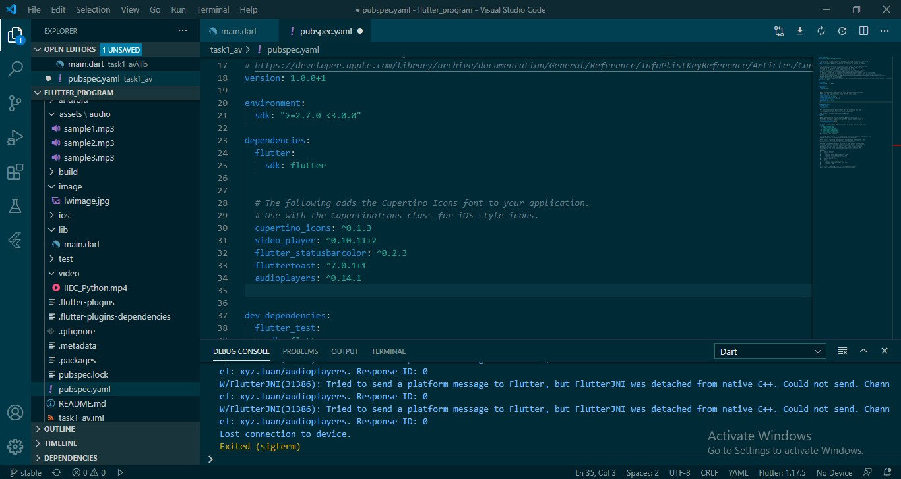
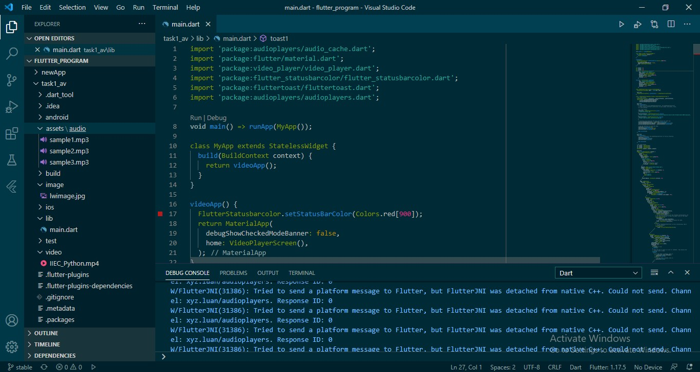
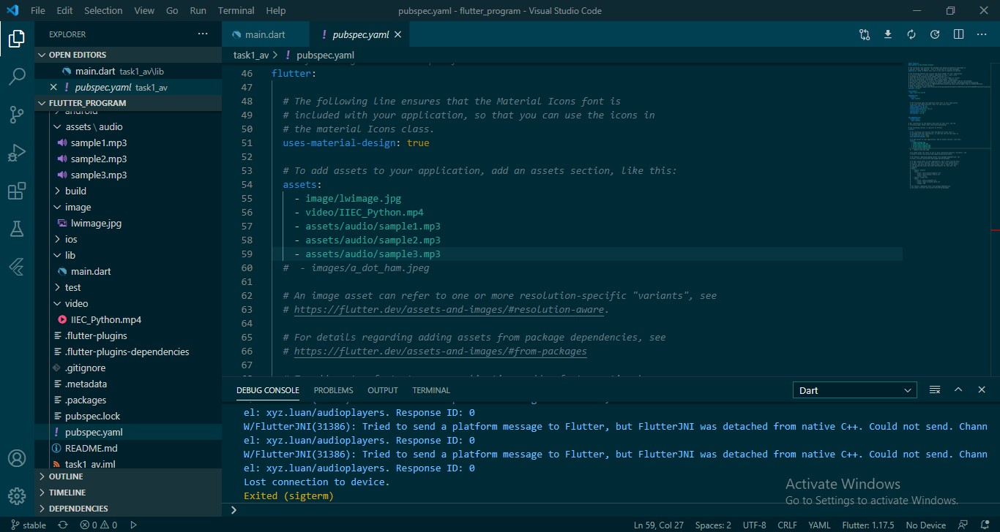
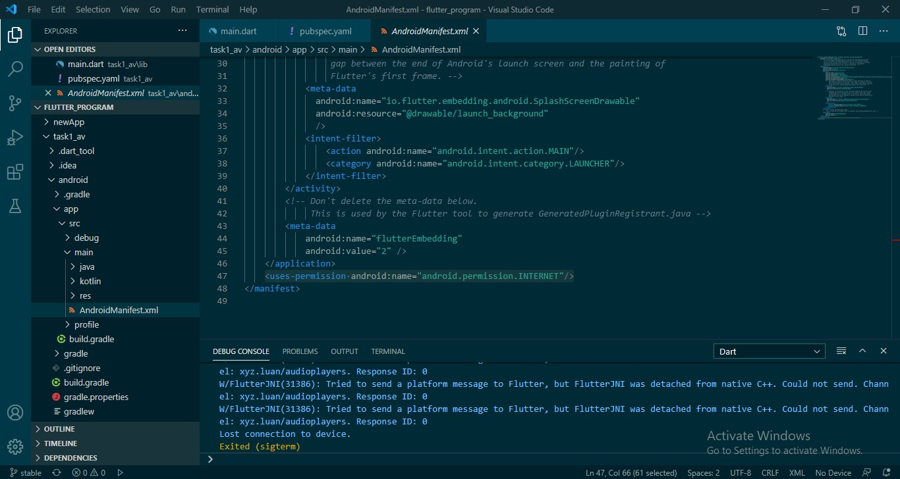

# flutter_task
Creating flutter app to play audio and video using network and assets. Before start coding, 

Add the required packages in the pubspec.yaml file

Add assets in your app directory

Add  assets path in pubspec.yaml 

Add a permision in the manifest file

[Watch the video](https://www.linkedin.com/posts/vikas-verma-4a02b51a2_flutterappdevelopment-task-fluttertraning-activity-6696272818742538240--fuJ)
